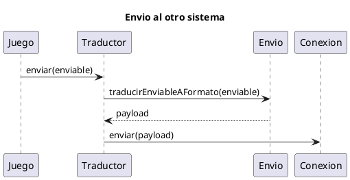
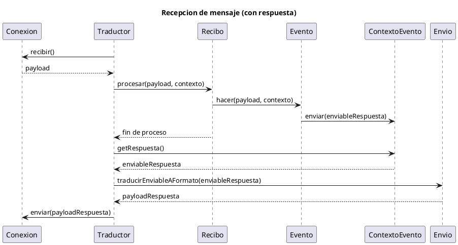
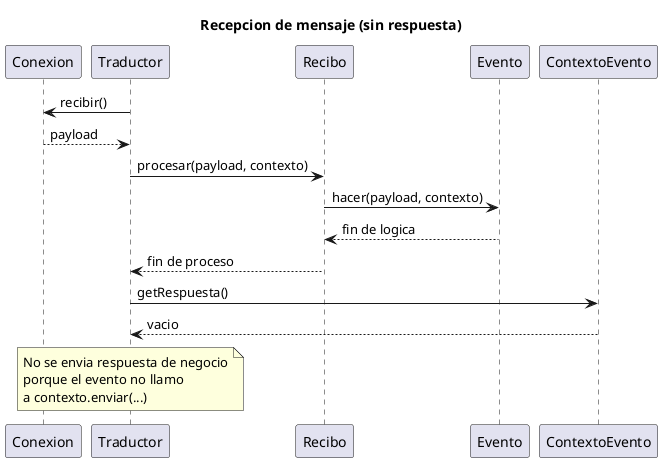

## Arquitectura de comunicación (versión actual)

Este documento describe la arquitectura de comunicación simétrica en backend y frontend después del refactor basado en eventos por comando.

## 1. Principio general

La arquitectura separa tres responsabilidades:

1. Lógica de dominio del juego.
2. Traducción entre objetos de dominio y payload de transporte.
3. Transporte físico (API, WebSocket, gRPC, etc.).

Con esto, el juego no depende del canal y el canal no depende de reglas de negocio.

## 2. Componentes

### 2.1 Enviable

Mensaje de dominio intercambiable entre backend y frontend. Cada clase concreta define `toJson()` y `fromJson(...)`.

### 2.2 Envio

Convierte un `Enviable` a un payload de transporte.

### 2.3 Evento<PAYLOAD>

Define la lógica de un comando entrante:

`hacer(payload, contexto)`

El evento decide qué hacer con el mensaje recibido y puede o no producir respuesta.

### 2.4 ContextoEvento

Permite que el evento publique la respuesta principal sin acoplarse al transporte:

`contexto.enviar(enviable)`

Si el evento no llama a `enviar`, la operación se considera sin respuesta de negocio.

### 2.5 Recibo<PAYLOAD>

Es el dispatcher de entrada por comando (Strategy):

1. Mantiene un diccionario `comando -> evento`.
2. Se construye de forma inmutable con `conEvento(...)`.
3. En `procesar(payload, contexto)`, extrae el comando y ejecuta el evento correspondiente.

### 2.6 Conexion<PAYLOAD>

Transporta payloads y expone tipo de comunicación (`API`, `WEBSOCKET`, etc.) con verificación de homología entre extremos.

### 2.7 Traductor<PAYLOAD>

Orquesta `Envio + Recibo + Conexion` y valida compatibilidad de payload.

Métodos principales:

1. `enviar(enviable)`.
2. `procesar(payload)`.
3. `recibirYProcesar()`.
4. `recibirProcesarYResponder()`.

## 3. Flujos

### 3.1 Flujo de envío

1. El juego crea un `Enviable`.
2. Llama a `Traductor.enviar(...)`.
3. `Envio` traduce a payload.
4. `Conexion` transmite el payload.

### 3.2 Flujo de recepción con respuesta

1. Llega payload a `Conexion`.
2. `Traductor` lo pasa a `Recibo.procesar(payload, contexto)`.
3. `Recibo` resuelve el comando y llama a `Evento.hacer(...)`.
4. El evento ejecuta lógica de dominio y llama `contexto.enviar(...)`.
5. `Traductor` serializa esa respuesta con `Envio` y la devuelve/envía por `Conexion`.

### 3.3 Flujo de recepción sin respuesta

Mismo flujo anterior, pero el evento no llama a `contexto.enviar(...)`. El resultado es una operación sin respuesta de negocio.

## 4. Simetría frontend-backend

Ambos lados siguen el mismo modelo:

1. `Enviable` para mensajes de dominio.
2. `Evento` para comandos de entrada.
3. `Recibo` como diccionario inmutable de eventos.
4. `Traductor` como orquestador único.
5. `Conexion` como adaptación al canal.

Esto permite cambiar de API a WebSocket/gRPC sin reescribir la lógica de juego.

## 5. Nota sobre JuegoConexion

`JuegoConexion` en frontend no es obligatorio. Si el juego puede usar `Traductor` directamente, se puede eliminar esa clase contenedora para simplificar capas.

## 6. Flujo de trabajo para un juego nuevo

### 6.1 Crear Enviables

1. Definir los mensajes de dominio necesarios.
2. Implementar `toJson()` y `fromJson(...)`.
3. Separar, si aplica, mensajes de entrada y de salida.

### 6.2 Crear Eventos

1. Crear una clase por comando (`Evento<PAYLOAD>`).
2. Implementar `hacer(payload, contexto)`.
3. Dentro de `hacer`, parsear/validar payload y delegar la lógica a un método interno tipado.
4. En el método interno, recibir datos normales y modelo de juego.
5. Si hay respuesta de negocio, llamar a `contexto.enviar(enviableRespuesta)`.

### 6.3 Registrar Eventos en Recibo

1. Crear instancia de `Recibo` (por ejemplo `JsonRecibo`).
2. Registrar comandos encadenando `conEvento("COMANDO", evento)`.
3. Resultado: un diccionario inmutable `comando -> evento`.

### 6.4 Montar Traductor

1. Elegir `Conexion` del canal (API/WebSocket/gRPC).
2. Elegir `Envio` para ese payload.
3. Usar el `Recibo` ya configurado con eventos.
4. Construir `Traductor(conexion, envio, recibo)`.

### 6.5 Ejecutar desde el juego o endpoint

1. Para salida explícita: `traductor.enviar(enviable)`.
2. Para entrada ya recibida: `traductor.procesar(payload)`.
3. Para bucle de entrada+salida automática: `traductor.recibirProcesarYResponder()`.

Con esto, añadir comandos nuevos es incremental: crear evento, registrar en el diccionario y listo.

## 7. Diagramas de secuencia (PlantUML)

### 7.1 Envio al otro sistema

### 7.2 Recepcion de mensaje (con respuesta)

### 7.3 Recepcion de mensaje (sin respuesta)

